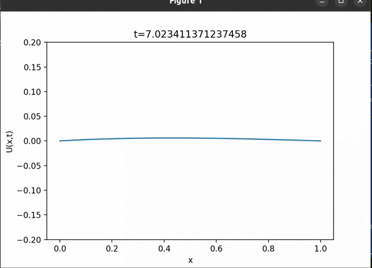
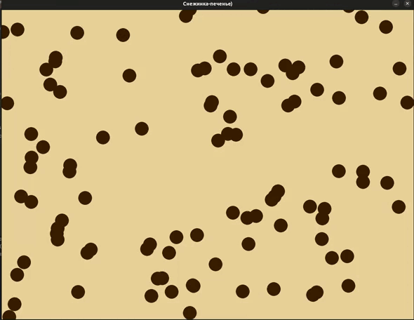

# Некоторые задачи компьютерной геометрии
## Проект компьютерной геометрии представляет собой набор задач, связанных с математическими расчетами и визуализацией. 
## В файле с классом снежинки реализованы методы для создания и манипуляции геометрическими фигурами, например, снежинками по определенным алгоритмам. Этот класс позволяет генерировать уникальные узоры, основанные на математических принципах.
## Второй файл содержит графическое построение волнового уравнения, которое позволяет визуализировать решения данного уравнения на компьютере. Это дает возможность наглядно представить колебания и волны, которые описываются этим уравнением.
## Примеры работы

